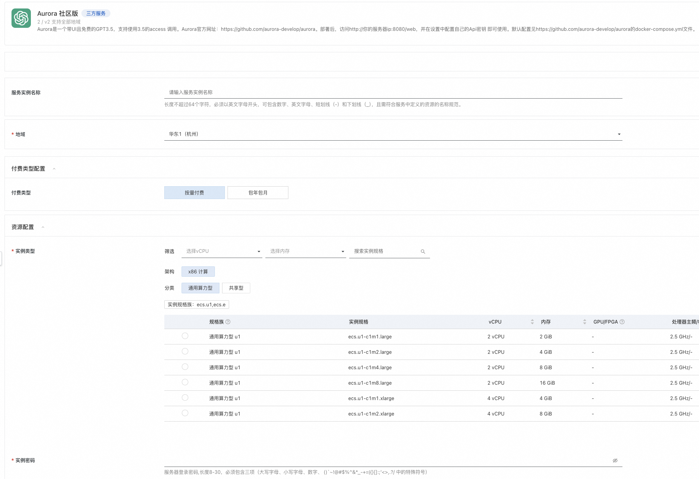
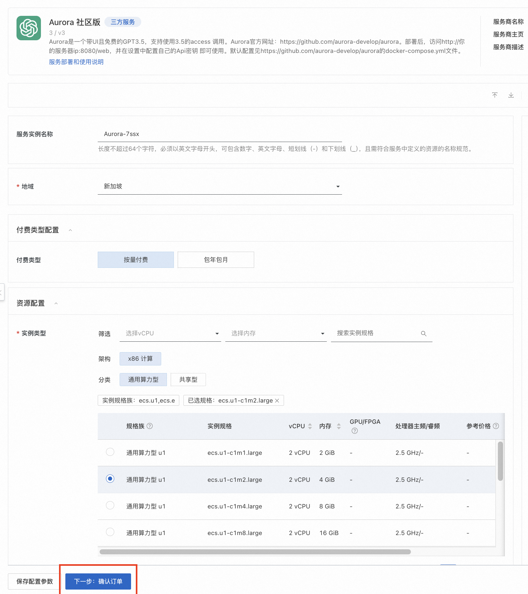
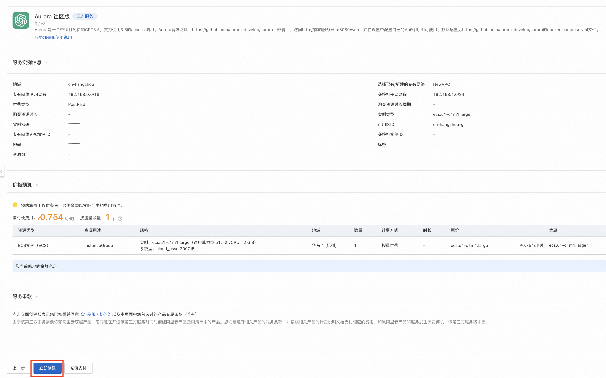
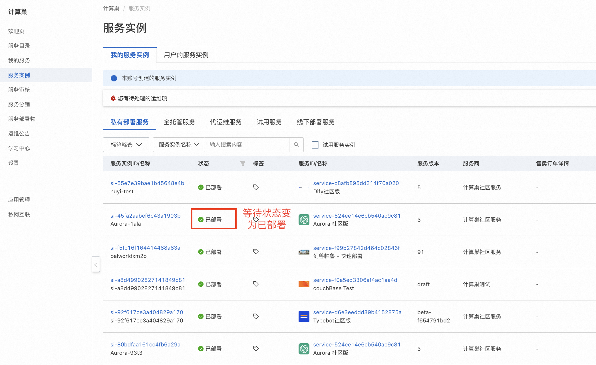
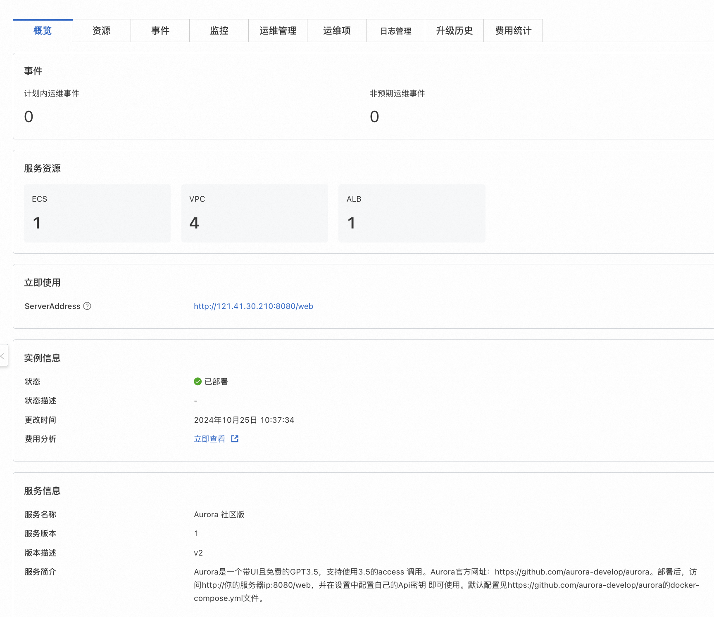
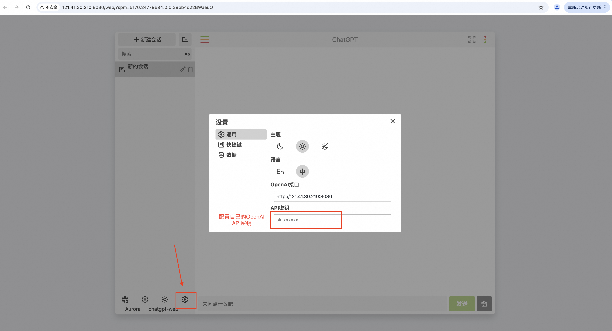
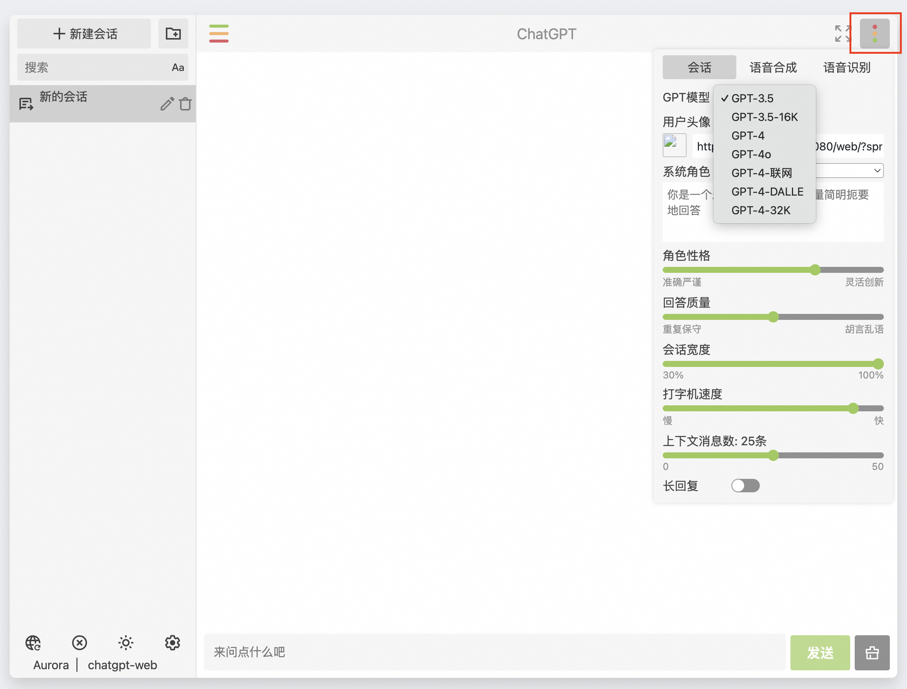
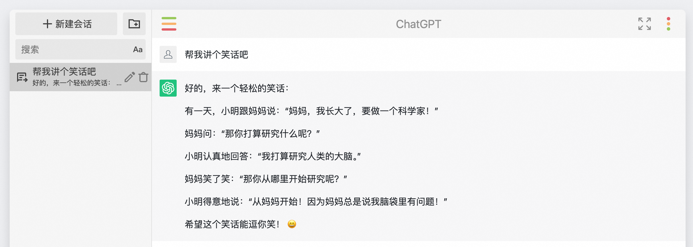

# Aurora计算巢快速部署

>**免责声明：**本服务由第三方提供，我们尽力确保其安全性、准确性和可靠性，但无法保证其完全免于故障、中断、错误或攻击。因此，本公司在此声明：对于本服务的内容、准确性、完整性、可靠性、适用性以及及时性不作任何陈述、保证或承诺，不对您使用本服务所产生的任何直接或间接的损失或损害承担任何责任；对于您通过本服务访问的第三方网站、应用程序、产品和服务，不对其内容、准确性、完整性、可靠性、适用性以及及时性承担任何责任，您应自行承担使用后果产生的风险和责任；对于因您使用本服务而产生的任何损失、损害，包括但不限于直接损失、间接损失、利润损失、商誉损失、数据损失或其他经济损失，不承担任何责任，即使本公司事先已被告知可能存在此类损失或损害的可能性；我们保留不时修改本声明的权利，因此请您在使用本服务前定期检查本声明。如果您对本声明或本服务存在任何问题或疑问，请联系我们。

## 概述

ChatGPT是美国人工智能研究实验室OpenAI在2022年11月30日推出的一款人工智能技术驱动的语言模型应用。由于OpenAI的国际背景，相比国内的多款大模型，ChatGPT在处理英文、跨文化信息时具有优势，能够更好地理解和生成不同语言和文化背景下的内容。

Aurora是一个带UI且免费的GPT私人聊天助手，您可通过Aurora，在简洁的UI配置下访问GPT，快速打造您专属的AI助手。专属AI助手具体不限流，响应速度快，模型种类多且切换方便的显著优势。Aurora官方网址：https://github.com/aurora-develop/aurora 。

阿里云计算巢已将Aurora打包为SaaS应用，您无需下载代码或安装复杂依赖，也无需连接国外VPN，仅需填写5个参数并等待5分钟，即可通过国内网络快速搭建私人聊天助手。

## 前提条件

部署Aurora社区版服务实例，需要对部分阿里云资源进行访问和创建操作。因此您的账号需要包含如下资源的权限。
  **说明**：当您的账号是RAM账号时，才需要添加此权限。

| 权限策略名称                          | 备注                     |
|---------------------------------|------------------------|
| AliyunECSFullAccess             | 管理云服务器服务（ECS）的权限       |
| AliyunVPCFullAccess             | 管理专有网络（VPC）的权限         |
| AliyunROSFullAccess             | 管理资源编排服务（ROS）的权限       |
| AliyunComputeNestUserFullAccess | 管理计算巢服务（ComputeNest）的用户侧权限 |

## 计费说明

Aurora社区版在计算巢部署的费用主要涉及：

- 所选vCPU与内存规格
- 系统盘类型及容量
- 公网带宽

## 部署架构

    

## 参数说明
| 参数组         | 参数项    | 说明                                                                     |
|-------------|--------|------------------------------------------------------------------------|
| 服务实例        | 服务实例名称 | 长度不超过64个字符，必须以英文字母开头，可包含数字、英文字母、短划线（-）和下划线（_） |
|             | 地域     | 服务实例部署的地域                                                              |
|             | 付费类型   | 资源的计费类型：按量付费和包年包月                                                      |
| ECS实例配置  | 实例类型   | 可用区下可以使用的实例规格                                                          |
|              | 实例密码   | 长度8-30，必须包含三项（大写字母、小写字母、数字、 ()`~!@#$%^&*-+=&#124;{}[]:;'<>,.?/ 中的特殊符号） |
| 网络配置        | 可用区    | ECS实例所在可用区                                                             |
|             | VPC ID | 资源所在VPC                                                                |
|             | 交换机ID  | 资源所在交换机                                                                |

## 部署流程
1. 访问计算巢Aurora社区版[部署链接](https://computenest.console.aliyun.com/service/instance/create/default?type=user&ServiceName=Aurora%20%E7%A4%BE%E5%8C%BA%E7%89%88)
   ，按提示填写部署参数。其中，地域选择新加坡（国内地域无法访问GPT模型），付费类型选择按量付费，可用区配置选择任意可用区ID与新建专有网络，其他部分保持默认值即可。
   
   

2. 参数填写完成，确认参数后点击**下一步：确认订单**。
   

3. 确认订单完成后同意服务协议，可以看到询价明细，点击**立即创建**
   进入部署阶段。
   
4. 提交成功后，点击**去列表查看**。等待部署完成，预计5分钟左右。
   
   

5. 等待部署完成后就可以开始使用服务，进入服务实例详情点击ServiceAddress链接。
   

6. 配置自己的OpenAI Api密钥，即可开始与你的GPT私人聊天助手进行对话。
   

7. 在右上角可以选择使用的GPT版本，支持切换GPT-3.5，4，4o等常用版本，并支持自定义角色性格、回答质量、回复速度和是否允许长回复等关键设定。
   

8. 开始使用Aurora
   